# Cognee video RAG

> NOTE: This project is built upon fork from https://github.com/topoteretes/cognee

## About Cognee

Cognee is an open-source AI memory platform for AI Agents. Ingest data in any format, and Cognee continuously builds a self-hosted knowledge graph that gives your agents persistent long-term memory across sessions. Cognee combines vector embeddings, graph reasoning, and cognitive-science-grounded ontology generation to make documents both searchable by meaning and connected by relationships that evolve as your knowledge does.

### Why use Cognee:

- Easily Build Company Brain - unify data from various sources in one place and enable Agents with your domain knowledge
- Knowledge infrastructure — unified ingestion, graph/vector search, runs locally, ontology grounding, multimodal
- Persistent and Learning Agents - learn from feedback, context management, cross-agent knowledge sharing
- Reliable and Trustworthy Agents - agentic user/tenant isolation, traceability, OTEL collector, audit traits

### How it Works

<p align="center">
  
</p>

<p align="center">
  
</p>

## Quickstart

Let’s try Cognee in just a few lines of code.

### Prerequisites

- Python 3.10 to 3.14

### Step 1: Install Cognee

You can install Cognee with **pip**, **poetry**, **uv**, or your preferred Python package manager.

```bash
uv pip install cognee
```

### Step 2: Configure the LLM
```python
import os
os.environ["LLM_API_KEY"] = "YOUR OPENAI_API_KEY"
```
Alternatively, create a `.env` file using our [template](https://github.com/topoteretes/cognee/blob/main/.env.template).

To integrate other LLM providers, see our [LLM Provider Documentation](https://docs.cognee.ai/setup-configuration/llm-providers).

### Step 3: Run the Pipeline

Cognee's API gives you four operations — `remember`, `recall`, `forget`, and `improve`:

```python
import cognee
import asyncio


async def main():
    # Store permanently in the knowledge graph (runs add + cognify + improve)
    await cognee.remember("Cognee turns documents into AI memory.")

    # Store in session memory (fast cache, syncs to graph in background)
    await cognee.remember("User prefers detailed explanations.", session_id="chat_1")

    # Query with auto-routing (picks best search strategy automatically)
    results = await cognee.recall("What does Cognee do?")
    for result in results:
        print(result)

    # Query session memory first, fall through to graph if needed
    results = await cognee.recall("What does the user prefer?", session_id="chat_1")
    for result in results:
        print(result)

    # Delete when done
    await cognee.forget(dataset="main_dataset")


if __name__ == '__main__':
    asyncio.run(main())

```

## Run with Docker

Prefer containers? Cognee publishes prebuilt images to Docker Hub on every push to `main`:
[`cognee/cognee`](https://hub.docker.com/r/cognee/cognee) (the API server)

### Option A — Docker Compose (build from source)

Clone the repo, create a `.env` with at least `LLM_API_KEY`, then:

```bash
cp .env.template .env   # then edit .env and set LLM_API_KEY

# Start the API server (http://localhost:8000)
docker compose up

# Optional profiles (combine as needed):
docker compose --profile ui up        # + frontend on http://localhost:3000
docker compose --profile mcp up       # + MCP server on http://localhost:8001
docker compose --profile postgres up  # + Postgres/PGVector
docker compose --profile neo4j up     # + Neo4j
```

> The `cognee` and `cognee-mcp` services publish different host ports (`8000` vs `8001`),
> so you can run both at once.

### Option B — Pull the prebuilt image (no clone required)

```bash
# Create a minimal .env in the current directory
echo 'LLM_API_KEY="YOUR_OPENAI_API_KEY"' > .env

# API server
docker run --env-file ./.env -p 8000:8000 --rm -it cognee/cognee:main

# MCP server (HTTP transport)
docker pull cognee/cognee-mcp:main
docker run -e TRANSPORT_MODE=http --env-file ./.env -p 8000:8000 --rm -it cognee/cognee-mcp:main
```

## Run the Whole Memory Layer on Postgres

Graph memory traditionally means operating a stack — a graph database for relationships, a vector database for embeddings, Redis for sessions, and a relational database for metadata — all deployed, secured, and paid for before an agent remembers anything. In cognee 1.0 you can run the entire memory layer on a single Postgres instance.

| Memory layer | Traditional stack | cognee on Postgres |
| --- | --- | --- |
| Relationships | Neo4j or another graph database | cognee's Postgres graph backend |
| Embeddings | Dedicated vector database | pgvector |
| Sessions | Redis | SQL session-cache backend |
| Metadata | Relational database | same Postgres |

The graph still exists — it just lives inside the same Postgres-backed memory layer as the text, metadata, and embeddings, so retrieval moves between similarity and structure without crossing service boundaries. In our CI benchmarks, Postgres search ran ~10% faster than the separate graph-plus-vector setup.

Postgres is the default we recommend for most deployments, but you can still swap in dedicated backends when a workload needs them (Neo4j and Neptune for graphs, Redis for sessions, pgvector and LanceDB for vectors, plus Qdrant, ChromaDB, Weaviate, and Milvus via community adapters). Local development stays fully embedded — SQLite, LanceDB, and Kuzudb — with no extra services to stand up.

```bash
pip install "cognee[postgres]"
```

```bash
DB_PROVIDER=postgres
VECTOR_DB_PROVIDER=pgvector
GRAPH_DATABASE_PROVIDER=postgres
CACHE_BACKEND=postgres

DB_HOST=localhost
DB_PORT=5432
DB_USERNAME=cognee
DB_PASSWORD=cognee
DB_NAME=cognee_db
```

## Deploy Cognee

| Platform | Best For | Command |
|----------|----------|---------|
| **Modal** | Serverless, auto-scaling, GPU workloads | `bash distributed/deploy/modal-deploy.sh` |
| **Railway** | Simplest PaaS, native Postgres | `railway init && railway up` |
| **Fly.io** | Edge deployment, persistent volumes | `bash distributed/deploy/fly-deploy.sh` |
| **Render** | Simple PaaS with managed Postgres | Deploy to Render button |
| **Daytona** | Cloud sandboxes (SDK or CLI) | See `distributed/deploy/daytona_sandbox.py` |

See the [`distributed/`](distributed/) folder for deploy scripts, worker configurations, and additional details.

## Benchmarks

We ran cognee against BEAM, a long-context benchmark that tests whether a system can keep track of a long conversation as it changes — a more useful test for agent memory than typical needle-in-a-haystack benchmarks. Using only cognee's default settings and standard open-source features (no custom models, no BEAM-specific pipelines), we beat the previous state of the art at the 100K-token setting and matched it at 10M tokens.

| Benchmark | Setting | cognee | Previous SOTA | Obsidian / RAG baseline |
|-----------|---------|--------|---------------|--------------------------|
| BEAM | 100K tokens | **0.79** (>0.8 with per-question routing) | 0.735 | ~0.33 |
| BEAM | 10M tokens | **0.67** | 0.641 | ~0.33 |

These numbers are a directional signal rather than a definitive measure — see the write-up for the full methodology, caveats, and what the results actually mean.


## Community & Support

### Contributing
We welcome contributions from the community! Your input helps make Cognee better for everyone. See [`CONTRIBUTING.md`](CONTRIBUTING.md) to get started.

