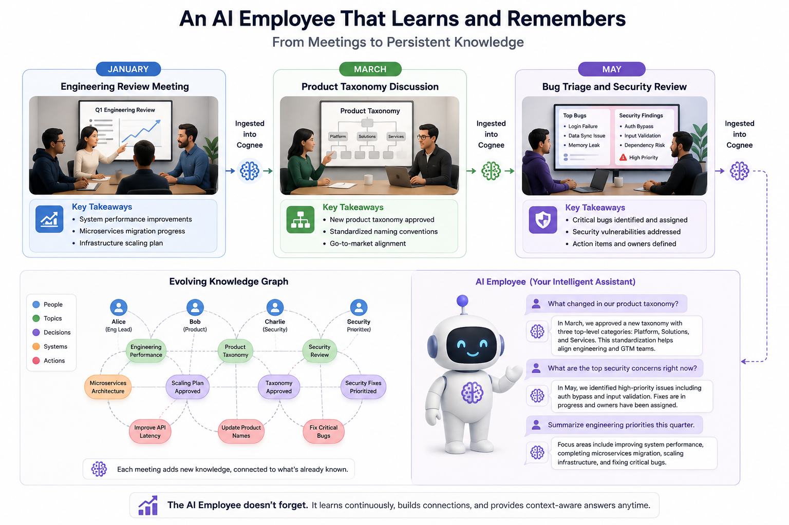

# Turning Meeting Videos into an AI Employee's Memory

## Intro
Every week company has sprint planning, architecture discussions, bug triage, and design reviews. Those decisions are scattered across hours of meeting recordings. In this project, I built an AI employee that watches every meeting, stores the important information in a knowledge graph, continuously updates its memory as new meetings arrive, and can answer questions about decisions made weeks or months ago.

[watch demo](https://www.youtube.com/watch?v=iI3C5pXqNf8)

